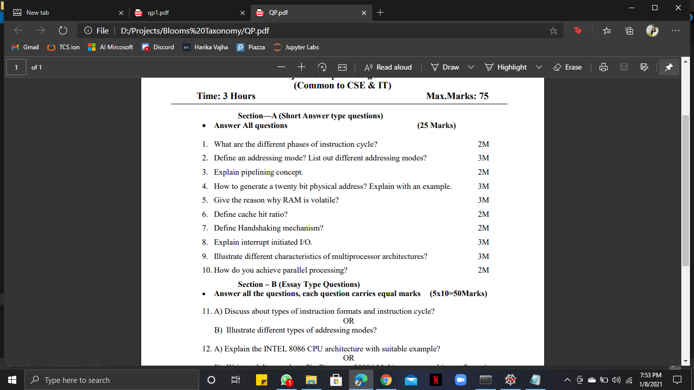
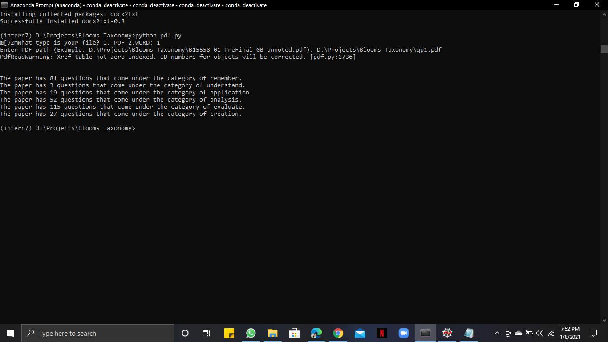

# BloomsTaxonomy
This project utilizes a machine learning algorithm to evaluate subjective question papers based on Bloom's Taxonomy. By analyzing the cognitive complexity of each question, the model classifies them into appropriate Bloom’s levels (e.g., Remember, Understand, Apply, Analyze, Evaluate, Create). Simply upload a question paper file, and the system will provide an assessment of its overall cognitive level distribution.

Ideal for educators, curriculum designers, and academic institutions aiming to align assessments with learning objectives.

So for example:

## If you give a question paper as follows:

## Result you get:

## How to run?

1. Clone the repository
2. Install requirements.txt using pip install -r requirements.txt
3. run pdf.py

# BloomsTaxonomyAnalysis
